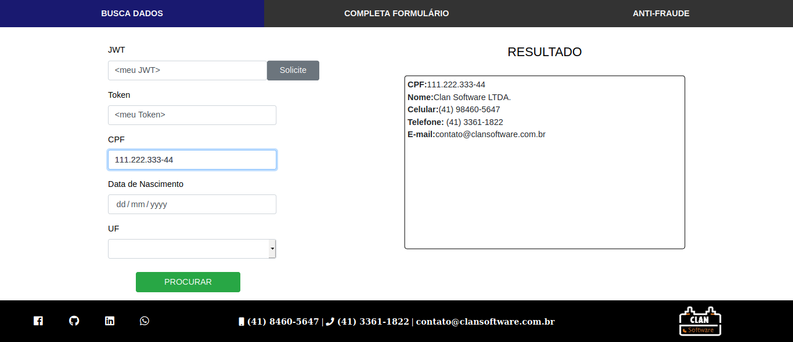

# PESQUISATUDO
[Site Oficial](https://clansoftware.com.br/ "Ir para: https://clansoftware.com.br")

<p>
	**PesquisaTudo** é uma API pela qual conseguimos localizar dados de uma pessoa por meio do CPF, data de nascimento e UF.
	Sendo CPF o único campo obrigatório, o sistema executa uma pesquisa em mais de 70 sites em todo o território nacional, retornando todas informação que encontrar na internet, tais como: Whatsapp, telefone, endereço e etc.
</p>



## Rodando Modelo
 
 1. Execute o comando: `git clone https://github.com/clansoftware/Radar-de-CPF.git`
 
 2. Acesse a pasta criada via terminal, executando o comando: `cd Radar-de-CPF`
 
 3. Execute o docker, utilize o comando: `docker-compose up -d`
 
 > Pronto, agora basta ir ao navegador de sua preferencia e acessar: `http://localhost`

## Implementando
	
<table border="1">
	<tr>
		<td>Campo</td>
		<td>Obrigatório</td>
		<td>Descrição</td>
		<td>Exemplo</td>
	</tr>
	<tr>
		<td>cpf</td>
		<td>
			
		</td>
		<td>
			Campo de númeração
		</td>
		<td>
			333.149.078-42
		</td>
	</tr>
	<tr>
		<td>datanascimento</td>
		<td>
			
		</td>
		<td>
			Campo do tipo data, em padrão americano
		</td>
		<td>
			1991-01-10
		</td>
	</tr>
	<tr>
		<td>uf</td>
		<td>
			
		</td>
		<td>
			Campo do tipo texto, com duas casas decimais em maiúsculo
		</td>
		<td>
			PR
		</td>
	</tr>
</table>
<br />
### Exemplo
<table border="1">
	<tr>
		<td>Entrada</td>
		<td>Saída</td>
	</tr>
	<tr>
		<td>
			Markup : ```var data = {
					"cpf": "33314907842",
					"datanascimento": "1991-01-10",
					"uf": "PR"}```
		</td>
		<td>
			
		</td>
	</tr>
</table>
<br />
<p>
	Dados possíveis de retorno:
</p>
- [x] Nome<br/>
- [x] Email<br/>
- [x] Celular, Whatsapp<br/>
- [x] Telefone<br/>
- [x] Endereço<br/>
- [x] Áreas/Produtos de interesse<br/>
<h2>Contato | Contact | Contacto</h2>
<a href="https://api.whatsapp.com/send?phone=554184605647" target="_BLANK">(41) 8460-5647</a> 

</a><a href="mailto:contato@clansoftware.com.br">contato@clansoftware.com.br</a>
